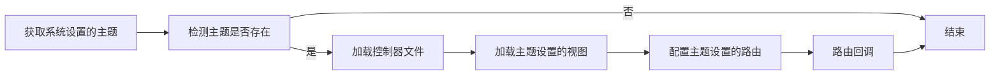
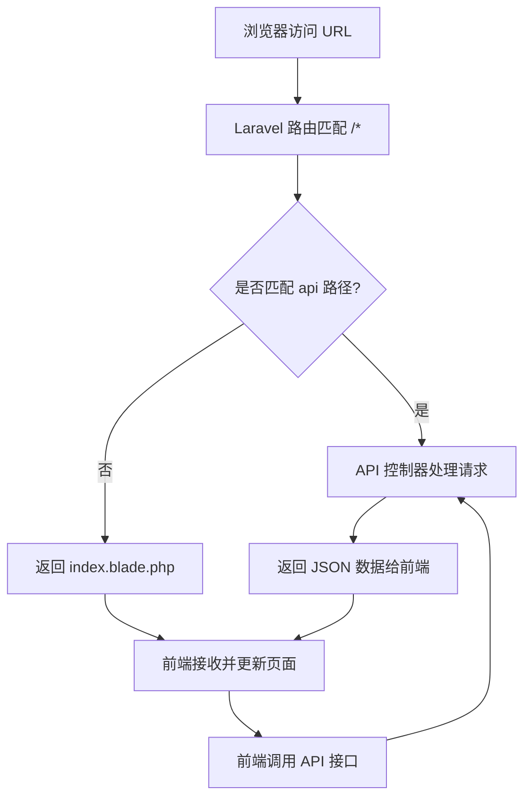

# 主题 {#theme}

兰空图床 2.x 是一个全新的前后端分离架构，后端使用 [Laravel](https://laravel.com)，前端使用 [Vue3](https://cn.vuejs.org)、[Pinia](https://pinia.vuejs.org/zh)、[Native UI](https://www.naiveui.com)。

相较于以前的版本，现在的版本使用了 Native UI 作为前端框架，使得样式一致、更统一。除了后台管理，我们可以自定义前端的样式，甚至可以直接替换整个前端。

若想要修改前端样式，您需要熟悉以下前端技术：

- [NodeJS](https://nodejs.org)
- [TypeScript](https://www.typescriptlang.org)
- [Vite](https://cn.vitejs.dev)
- [Vue3](https://cn.vuejs.org)
- [Pinia](https://pinia.vuejs.org)
- [Vue Router](https://router.vuejs.org)
- [Tailwind CSS](https://tailwindcss.com)

若想要开发新的主题，您需要熟悉以下技能和框架
- [Laravel](https://laravel.com)
- [Laravel Blade](https://laravel.com/docs/12.x/blade)
- [Filamentphp](https://filamentphp.com)

## 主题是如何运作的？ {#theme-works}

系统存在两个不同的主题存放位置：

- `app/Themes/` 系统内置主题
- `themes/` 第三方主题

我们添加新开发的主题，需要将主题存放到程序根目录中的 `themes/` 文件夹。

主题系统可以使用标准的 PHP 8.2+ 的语法，使用 Laravel 框架进行开发。一个完整的插件的基本目录结构如下：

```
my-test/                    # 主题文件夹名称，需要与主题 id 保持一致
 ├─ assets/                 # 静态资产目录
 │  ├─ css/                 # css 样式文件目录
 │  ├─ fonts/               # 字体文件目录
 │  ├─ images/              # 图片目录
 │  └─ js/                  # js 文件
 ├─ controllers/            # PHP 控制器目录
 │  └─ YourController.php   # 控制器示例文件
 ├─ views/                  # 视图层，需要以 *.blade.php 结尾
 │  ├─ components/          # blade 组件目录
 │  │  └─ button.blade.php  # 示例 button 组件
 │  ├─ layouts/             # 布局目录
 │  │  └─ app.blade.php     # 示例布局组件
 │  ├─ pages/               # 视图文件
 │  └─ └─ index.blade.php   # 示例布局组件
 ├─ README.md               # 主题说明文档
 └─ MyTestTheme.php         # 主题入口类
```

### 主题入口类 {#entrance}

```php
<?php

namespace Themes\MyTest;

use App\Contracts\ThemeAbstract;
use Filament\Forms\Components\Textarea;
use Filament\Forms\Components\TextInput;
use Filament\Schemas\Components\Grid;
use Filament\Schemas\Components\Section;
use Illuminate\Support\Facades\Route;

/**
 * 测试主题 - 这是一个测试主题
 * 
 * @author Unknown
 * @version 1.0.0
 */
class MyTestTheme extends ThemeAbstract
{
    /** @var string 主题唯一标识符 */
    public string $id = 'my-test';

    /** @var string 主题名称，显示在管理界面中 */
    public string $name = '测试主题';

    /** @var string|null 主题描述 */
    public ?string $description = '这是一个测试主题';

    /** @var string 主题作者 */
    public string $author = 'Unknown';

    /** @var string 主题版本 */
    public string $version = '1.0.0';

    /** @var string|null 主题官网或仓库地址 */
    public ?string $url = '';

    /**
     * 主题路由配置
     * 在这里定义你的主题路由，例如首页、详情页等
     */
    public function routes(): void
    {
        Route::get('/', fn () => view("{$this->id}::pages.index"));

        // ...
    }

    /**
     * 主题配置表单
     * 返回 Filament 表单组件数组，用于在管理后台配置主题
     * 
     * @return array Filament 表单组件数组
     */
    public function configurable(): array
    {
        return [
            Section::make('基础设置')->schema([
                Grid::make()->columns(2)->schema([
                    $this->getSiteTitleField(),
                    $this->getSiteSubtitleField(),
                ]),
                $this->getSiteDescriptionField(),
                $this->getSiteKeywordsField(),
            ]),
            
            Section::make('首页设置')->schema([
                $this->getWelcomeMessageField(),
                $this->getFooterTextField(),
            ]),
        ];
    }

    /**
     * 数据转换器配置
     * 定义如何处理配置数据，例如将相对路径转换为完整URL
     * 
     * @return array 转换器配置
     */
    public function casts(): array
    {
        return [
            // 示例：将图片路径转换为完整URL
            // 'logo_path' => new Attribute(
            //     get: fn($value) => $value ? Storage::url($value) : ''
            // ),
        ];
    }

    /**
     * 网站标题配置字段
     */
    protected function getSiteTitleField(): TextInput
    {
        return TextInput::make('payload.site_title')
            ->label('网站标题')
            ->helperText('显示在浏览器标题栏和搜索结果中')
            ->maxLength(100)
            ->required()
            ->placeholder('请输入网站标题');
    }

    /**
     * 网站副标题配置字段
     */
    protected function getSiteSubtitleField(): TextInput
    {
        return TextInput::make('payload.site_subtitle')
            ->label('网站副标题')
            ->helperText('显示在网站标题下方的副标题')
            ->maxLength(100)
            ->placeholder('请输入网站副标题');
    }

    /**
     * 网站描述配置字段
     */
    protected function getSiteDescriptionField(): Textarea
    {
        return Textarea::make('payload.site_description')
            ->label('网站描述')
            ->helperText('用于SEO优化，显示在搜索结果中')
            ->maxLength(500)
            ->rows(3)
            ->placeholder('请输入网站描述');
    }

    /**
     * 网站关键词配置字段
     */
    protected function getSiteKeywordsField(): TextInput
    {
        return TextInput::make('payload.site_keywords')
            ->label('网站关键词')
            ->helperText('用于SEO优化，多个关键词用英文逗号分隔')
            ->maxLength(200)
            ->placeholder('图床,图片托管,免费图床');
    }

    /**
     * 欢迎消息配置字段
     */
    protected function getWelcomeMessageField(): Textarea
    {
        return Textarea::make('payload.welcome_message')
            ->label('欢迎消息')
            ->helperText('显示在首页的欢迎消息')
            ->maxLength(500)
            ->rows(4)
            ->placeholder('欢迎使用我们的图片托管服务！');
    }

    /**
     * 页脚文本配置字段
     */
    protected function getFooterTextField(): Textarea
    {
        return Textarea::make('payload.footer_text')
            ->label('页脚文本')
            ->helperText('显示在页面底部的版权信息或其他文本')
            ->maxLength(300)
            ->rows(2)
            ->placeholder('© 2024 您的网站名称. All rights reserved.');
    }

    /**
     * 获取配置值的辅助方法
     * 
     * @param string $key 配置键名
     * @param mixed $default 默认值
     * @return mixed 配置值
     */
    protected function getConfig(string $key, mixed $default = null): mixed
    {
        return $this->getSettings($key, $default);
    }

    /**
     * 获取原始配置值的辅助方法（不经过转换器处理）
     * 
     * @param string $key 配置键名
     * @param mixed $default 默认值
     * @return mixed 原始配置值
     */
    protected function getRawConfig(string $key, mixed $default = null): mixed
    {
        return $this->getRawSettings($key, $default);
    }
}
```

在后台管理的主题管理中，系统会通过扫描主题文件夹，并实例化主题入口类获取主题基本配置与表单配置，`MyTestTheme.php` 示例：

可以看到入口文件 `MyTestTheme.php` 中通过 PHP 的属性设置了主题的相关信息。并通过实现继承的抽象类中的 `routes`、`configurable`、`casts` 方法。

通常情况下，一个完整的主题需要实现这三个方法才可以使主题正常使用。

### 生命周期



系统成功加载主题后，主题保存的配置可以在 blade 视图文件中可以使用 `ThemeService` 服务类获取相关配置，例如：

- 获取配置项 title：`\App\Facades\ThemeService::getTheme('default')->getSettings('title')`
- 获取全部配置：`\App\Facades\ThemeService::getTheme('default')->getSettings()`

如果您的主题是 spa 单页面模式，可以请求 `/api/v2/configs` 接口，返回的 json 中的 `data.site` 获取全部配置。

### routes 方法 {#routes}

::: tip
有关 Laravel 路由的详细文档请查阅 Laravel 官方文档：[https://laravel.com/docs/12.x/routing](https://laravel.com/docs/12.x/routing)
:::

主题通过实现 `routes` 方法来定义程序所需要的路由。例如：

```php
<?php

// ...省略部分代码

use Illuminate\Support\Facades\Route;
use Themes\MyTest\Controllers\YourController;

// ...省略部分代码

public function routes(): void
{
    // 定义一个访问首页的路由，直接返回视图
    Route::get('/', fn () => view("{$this->id}::pages.index"));
    
    // 也可以导入控制器文件
    Route::get('/', [YourController::class, 'index']);

    // 如果你的主题是单页应用（SPA），可以这样配置：
    // 表示访问除了 /api 开头的所有路径都路由到 YourController 的 index 方法 
    // Route::any('/{any}', [YourController::class, 'index'])->where('any', '^(?!api).*');
}
```

### casts 方法 {#casts}

如果我们的主题中存在文件上传配置，比如 logo，我们在 `/configs` 接口中获取到的配置，文件不会返回完整的 url，而是文件名称+拓展名。

我们可以通过定义 `casts` 来转换返回值：

```php
<?php

// ...省略部分代码

use App\Support\Attribute;
use Illuminate\Support\Facades\Storage;

// ...省略部分代码

public function casts(): array
{
    return [
        'logo' => new Attribute(
            // 我们可以使用 laravel 提供的 Storage 类获取程序文件的完整 url
            get: fn(?$value) => $value ? Storage::url($value) : '',
            // get 用于获取时转换数据，我们也可以定义 set 让其在储存主题配置前转换数据
            // set: fn (?$value) => $value ? 'yes' : 'no',
        ),
    ];
}
```

### configurable 方法 {#configurable}

`configurable` 方法用于配置主题在后台管理中的「主题配置」表单，表单构建需要使用 [Filamentphp](https://filamentphp.com/docs/4.x)。
Filament 是 Laravel 的服务器驱动 UI (SDUI) 框架。它允许您使用结构化配置对象（而非传统的模板）完全用 PHP 定义用户界面。您可能需要花费一些时间去了解此框架才能更好的去实现配置表单。

大多数情况下，我们构建表单需要用到的有：

- [Filamentphp Forms](https://filamentphp.com/docs/4.x/forms/overview)
- [Filamentphp Schemas](https://filamentphp.com/docs/4.x/schemas/overview)

注意，所有表单字段的 id，都必须以 `payload.` 开头，比如我们需要建立一个网站标题的配置项，名称必须是 `payload.title`。 一个最小化配置表单结构示例：

```php
<php

// ...省略部分代码

use Filament\Forms\Components\TextInput;

// ...省略部分代码

public function configurable(): array
{
    return [
        // TextInput 组件文档：https://filamentphp.com/docs/4.x/forms/text-input
        TextInput::make('payload.title')
            ->label('网站标题')
            ->maxLength(60)
            ->minLength(1)
            ->required()
            ->placeholder('请输入网站标题');
    ];
}
```

配置好以后我们在后台管理的主题管理中，选择您的主题，便会出现「网站标题」配置表单。

## 创建新的主题 {#create-theme}

为了使开发者更方便的开发主题，我们在系统内部集成了生成主题模版的交互式命令：

```shell
php artisan make:theme
```

在程序根目录执行此命令，根据提示填写相关配置后即可在 `themes/` 目录中生成一个主题模版，您可以直接修改此模版以开发自己的主题。

## 修改默认主题 {#edit-default-theme}

默认主题是典型的混合部署，利用 laravel 通配符路由（排除`/api`开头的路由）匹配所有 url 请求路由到主题入口，然后通过 blade 优先渲染 spa 单页的入口文件，spa 单叶渲染完成后调用 `/api` 开头的相关接口获取数据，从而实现前后端不需要配合 nginx 伪静态即可实现混合部署，解决了 spa 单页在刷新网页时出现 404 的问题。生命周期图：



理解以上生命周期图，有利于您更好的开发 spa 单页主题。若要修改主题，您需要在您的设备上安装 [Nodejs](https://nodejs.org)。

使用终端进入根目录中的 `web` 文件夹，运行命令安装相关库：

::: code-group

```shell [Yarn]
yarn
```

```shell [Npm]
npm install
```

:::

运行调试命令启动开发服务器：

::: code-group

```shell [Yarn]
yarn dev
```

```shell [Npm]
npm run dev
```

:::

然后就可以愉快的修改样式了。

您还可以修改环境变量文件 `web/.env` 中的 `VITE_APP_API_URL` 参数值来调整接口地址。

只需在您修改了前端工程文件后，执行构建命令：

::: code-group

```shell [Yarn]
yarn build
```

```shell [Npm]
npm run build
```

:::